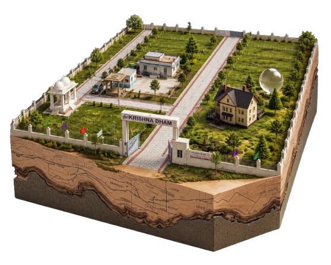

<div align="center">

# 🌐 Krishna Dham — 360° Virtual Tour



### *Walk through your future home before you buy it.*

[](https://react.dev)
[](https://vite.dev)
[](https://tailwindcss.com)
[](https://pannellum.org)
[](https://aws.amazon.com/s3/)

[](LICENSE)
[](package.json)
[]()
[]()

</div>

---

## 🏆 Achievements

<div align="center">


</div>

---

## ✨ Features

| Feature | Description |
|---------|-------------|
| 🔭 **360° Street View** | Navigate 113 panoramic images of the colony like Google Maps Street View |
| 🏹 **Smart Hotspots** | Arrows auto-position at exact yaw/pitch using gnomonic projection math |
| 🗺️ **Master Plan Map** | Full colony layout with TC&P approved plot details |
| 🎬 **Video Gallery** | Live preview video + 12-image masonry photo grid |
| 📱 **Fully Responsive** | Works on all screen sizes from mobile to 4K |
| ⚡ **AWS S3 Powered** | 113 panoramas served via S3 with Vite proxy for CORS-free loading |
| 🌿 **Premium Design** | Glassmorphism, smooth animations, Montserrat + Cormorant Garamond fonts |

---

## 🚀 Tech Stack

<div align="center">

| Layer | Technology |
|-------|-----------|
| **Frontend** | React 19 + Vite 8 |
| **360° Viewer** | Pannellum React |
| **Styling** | TailwindCSS 4 + Vanilla CSS |
| **Routing** | React Router DOM v6 |
| **Icons** | Lucide React |
| **Storage** | AWS S3 (eu-north-1) |
| **Fonts** | Google Fonts (Montserrat, Cormorant Garamond, Great Vibes) |

</div>

---

## 📁 Project Structure

```
krishna-dam/
├── public/
│   ├── data/
│   │   ├── map.json          # 1962 lines of hotspot navigation data
│   │   ├── angles.json       # Initial yaw/pitch for 113 panoramas
│   │   └── remote_urls.json  # S3 URLs for all 113 images
│   ├── 3D.png                # Hero 3D colony model
│   ├── map.png               # Master plan layout
│   └── VIDEO.mp4             # Colony walkthrough video
└── src/
    ├── LandingPage.jsx       # Hero section + full page scroll
    ├── View360.jsx           # 360° tour controller (113 images)
    ├── PanoramaViewer.jsx    # Pannellum viewer + gnomonic arrow projection
    ├── MapPreview.jsx        # Master plan with plot details
    ├── FeaturesSection.jsx   # Premium amenities showcase
    ├── VideoSection.jsx      # Video + masonry image grid
    ├── AboutPage.jsx         # About Krishna Dham
    ├── ContactSection.jsx    # Contact information
    └── Footer.jsx            # Footer with social links
```

---

## 🛠️ Getting Started

```bash
# Clone the repository
git clone https://github.com/RC-Rahul-JS/krishna-dam.git
cd krishna-dam

# Install dependencies
npm install --legacy-peer-deps

# Start development server
npm run dev

# Build for production
npm run build
```

---

## 🗺️ Pages & Routes

| Route | Page | Description |
|-------|------|-------------|
| `/` | Landing Page | Hero, About, Map, Features, Video, Contact |
| `/tour` | 360° Tour | Full immersive street-view navigation |
| `/about` | About | Krishna Dham colony details |

---

## 🏡 About Krishna Dham

> *Krishna Dham is an exclusive plotted community designed for those who appreciate premium living.*

- 📐 **Plot Sizes**: 100–500 sq.yd
- 💰 **Booking**: Starting from ₹20,000
- 🏗️ **Total Price**: ₹11 Lakh onwards
- ✅ **Status**: Fully TC&P Approved
- 🌿 **Features**: Vastu-Compliant, Gated Community, Wide CC Roads, Underground Electricity, 24/7 Water Supply

---

## 📸 Screenshots

| Landing Page | 360° Tour |
|-------------|-----------|
| Hero with 3D model, features & pricing | Immersive street-view with navigation arrows |

---

<div align="center">

**Built with ❤️ by [RC-Rahul-JS](https://github.com/RC-Rahul-JS)**

[](https://github.com/RC-Rahul-JS)

*Managed & Handled by **Duniyape Technologies***

</div>
